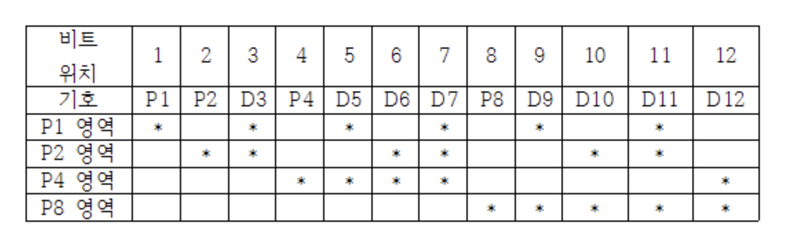
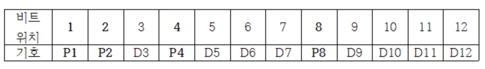
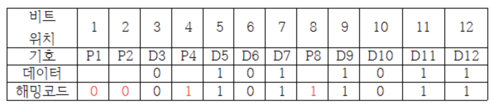

### 패리티 비트
정보 전달 과정에서 오류 발생 여부를 검사하기 위해 추가하는 비트.
- 바이너리 코드의 비트열 끝단에 추가하는 비트 하나를 의미
- 정보 전달 과정에서 오류 발생 유무를 검사하는 검출 코드
- 해당 비트열 안에서 1의 개수가 홀수인지 짝수인지 알 수 있다.
  - 짝수 패리티 비트 : 전체 비트열 내의 비트 1의 개수가 짝수 개가 되도록 패리티 비트를 정하는 것
  - 홀수 패리티 비트 : 전체 비트열 내의 비트 1의 개수가 홀수 개가 되도록 패리티 비트를 정하는 것
- 만약 1의 개수의 합이 설정한 패리티 종류로 정한 개수와 다르다면 전송 중 데이터 비트에 오류가 발생했다는 것을 의미
- 패리티 비트만으로는 데이터 비트열 내에 2개의 오류가 함께 발생한 경우를 검출해낼 수 없다. 
- 오류 발생 여부만 알 수 있을 뿐 어느 비트에 오류가 발생했는지는 검출할 수 없고 수정할 수도 없다.

### 해밍 코드
데이터 전송 시 1비트의 에러를 정정할 수 있는 자기 오류정정 코드를 말한다. 패리티비트를 보고, 1비트에 대한 오류를 정정할 곳을 찾아 수정할 수 있다.
(패리티 비트는 오류를 검출하기만 할 뿐 수정하지는 않기 때문에 해밍 코드를 활용)

### 추가되는 패리티 비트 수 구하기
2^p >= d+p+1 (d: 데이터 비트수, p: 패리티 비트수)

### 패리티 비트 위치 예제
데이터 비트 수가 8인 경우 추가되는 패리티 비트의 수 : 2^p >= 8+p+1
- 위 식을 만족하는 p의 최소값은 4
- 따라서 해밍 코드의 전체 비트 수는 8+4 => 12

### 패리티 비트 체크 범위 확인 및 패리티 비트의 값 결정
- n번째 패리티 비트는 n번째에서 시작하며, n비트 만큼을 포함하고 n 비트씩 건너뛴 비트들을 대상으로 패리티 비트 범위를 지정하고 각 패리티 비트를 결정함

- p1의 영역 = D3 + D5 + D7+ D9 + D11
- p2의 영역 = D3 + D6 + D7 + D10 + D11
- p4의 영역 = D5 + D6 + D7 + D12
- p8의 영역 = D9 + D10 + D11 + D12

만약 전송할 데이터 비트가 01011011이고 짝수 패리티 비트를 사용한다면
- p1 = d3 + d5 + d7 + d9 + d11 = 0 + 1 + 1 + 1 + 1 = 0
- p2 = d3 + d6 + d7 + d10 + d11 = 0 + 0 + 1 + 0 + 1 = 0
- p4 = d5 + d6 + d7 + d12 = 1 + 0 + 1 + 1 = 1
- p8 = d9 + d10 + d11 + d12 = 1 + 0 + 1 + 1 = 1

### 오류 검출 및 오류 비트 수정
해밍 코드를 통해 오류 검출 및 오류 비트를 수정하려면 신드롬 값을 구하고 이를 통해 이루어짐

### 신드롬
패리티 비트를 포함하여 얻은 2진수 값으로 0 ~ 15 사이의 값으로 만들어지는 오류 값.
만약 신드롬 값이 0이라면 오류가 없는 것이며 만약 신드롬 값이 6이면 6번째 비트인 D6에서 오류가 발생한것

### 신드롬 값 구하기

- C1 = p1 + d3 + d5 + d7 + d9 + d11 = 0 + 0 + 1 + 1 + 1 + 1 => 0
- C2 = p2 + d3 + d6 + d7 + d10 + d11 = 0 + 0 + 0 + 1 + 0 + 1 => 0
- C4 = p4 + d5 + d6 + d7 + d12 = 1 + 1 + 0 + 1 + 1 => 0
- C8 = p8 + p9 + d10 + d11 + d12 = 1 + 1 + 0 + 1 + 1 => 0

0bC1C2C4C8 = 0b0000 = 0이므로 오류가 없다.